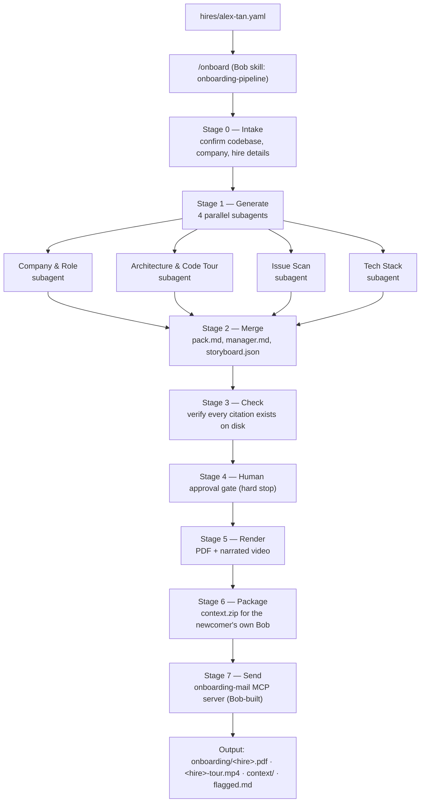

# Bob Onboarding Pipeline — from a raw codebase to a verified onboarding pack, with IBM Bob 2.0

**Workflow improved: developer onboarding.** Bob Onboarding Pipeline turns a real codebase into a personalized onboarding pack for a specific new hire — a branded PDF, a narrated code tour, one file per real issue found, a context folder for their own Bob, and a manager brief. Parallel Bob subagents do the generation; deterministic tooling checks every claim before anything renders or sends.

## The problem

A new developer's first weeks are slow and inconsistent. They get a stale README and a wiki link, while a senior spends days re-explaining where the code starts, what's broken, and which tools to install. The knowledge lives in people's heads, so:

- Every hire gets a different, ad-hoc onboarding experience
- The team pays for it twice — the newcomer's ramp-up time and the senior's lost time
- Nothing is grounded in the actual code, so guidance drifts stale within weeks

This costs real hours per hire, and there's no repeatable, testable process behind it — just whoever happens to onboard you.

## The solution

*Each subagent reads the real repo and writes its section with file:line evidence — not opinions.*

## Bob features used

| Bob feature | How this project uses it |
|---|---|
| Skill + slash command | Packaged as `.bob/skills/onboarding-pipeline` with an `/onboard` command; Bob follows the stage list exactly |
| Agent mode | The full pipeline runs end to end as one Bob-driven workflow, stage by stage |
| Parallel subagents | Four subagents generate company/role, architecture/tour, issue scan, and tech stack at once, each in isolated context |
| Document understanding | Reads the target repo's source, manifests, and docs to ground every claim in real code |
| MCP server creation | Bob built `mcp/onboarding-mail/server.py` itself — a local STDIO server exposing `send_onboarding_email`, SMTP from env vars only, with a `--dry-run` mode |
| Bounded fix loop | When a deterministic check fails, Bob repairs mechanically first, then makes the smallest targeted fix — max 3 attempts per stage |
| Human-in-the-loop gate | Bob stops at Stage 4 and shows the flagged list; nothing renders or sends without explicit approval |

## Why you can trust it

Onboarding material that invents facts is worse than none — so the pipeline never lets the model grade itself:

- Every cited `file:line` is checked with plain Python against the real repository — not self-reported by the agent
- Anything Bob can't confirm becomes `"Unknown, ask your buddy"` on a flagged list, never a guess
- A human must approve the flagged list before anything renders or sends — tool auto-approve does not count as approval
- The target codebase is opened **read-only**; secrets are never copied into the onboarding pack
- The checker itself is tested: `_guide_self_test` and `_storyboard_self_test` cover the cases that matter — redundant on-screen/narration text, missing flow coverage, and citation drift

## Commands

| Command | What it does |
|---|---|
| `/onboard @<codebase> @hires/<name>.yaml` | Full pipeline: intake → 4 parallel subagents → merge → check → human gate → render → send |
| `python scripts/pipeline_tools.py check` | Re-run the deterministic citation/consistency checks without regenerating content |
| `python scripts/pipeline_tools.py check-mcp --fix` | Detect SMTP credentials in `.env` and register the mail server accordingly (dry-run or live) |
| `python scripts/selftest.py` | Verify the whole toolchain (PDF render, video render, checks) before a real run |

## Demo target

`CTMS_Project` — a Java/JSP Jakarta EE cinema ticket booking system (movies, showtimes, seat bookings, Stripe payments), chosen because it's a real, undocumented legacy-style codebase with genuine problems for a new hire to discover:

| Severity | Issues found |
|---|---|
| 🔴 Critical | Hardcoded DB credentials, hardcoded Stripe key + webhook secret, plaintext password comparison |
| 🟠 High | SQL syntax bug in `CustomerDAO.deleteCustomer`, no test suite, no connection pooling |
| 🟡 Medium | Duplicate servlet declarations, null-session handling gap, password exposed in session, no input validation |

All 10 issues are reported with `file:line` evidence and guidance — not a patch — so the hire understands *why*, not just *what*.

## Impact

| | Manual | Bob Onboarding Pipeline |
|---|---|---|
| Prepare onboarding material for one hire | an estimated **[X] hours** | **~20 minutes** machine time + ~1 minute human approval |
| Consistency across hires | depends who's free that week | same deterministic process every time |
| Grounded in real code | only if the senior double-checks | every claim verified against `file:line` |
| Issues surfaced before day one | usually none | 10 found automatically, including 3 credential leaks |

*Proof of concept — tested on one project so far.*

## Run it

Requirements: IBM Bob IDE, this folder open as the workspace, a `.env` with SMTP credentials (see `.env.example`).

cd bob-onboarding-workspace
py -3 scripts/selftest.py          # confirm the toolchain is clean

In Bob:

/onboard @CTMS_Project @hires/alex-tan.yaml

Then open `onboarding/alex-tan.pdf` and check your configured test inbox for the delivered pack.

## Bring this to your own project

The core is generic — everything client-specific lives in one hire file and one target-codebase path:

1. Point `/onboard` at your own repo instead of `CTMS_Project`
2. Write a new `hires/<name>.yaml` with role, dates, manager, and buddy
3. Run `/onboard @<your-repo> @hires/<name>.yaml`

A new hire — or a new company entirely — is a new file, not a code change.
