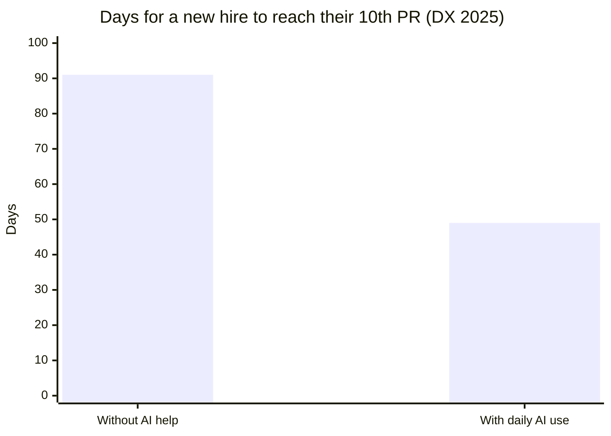
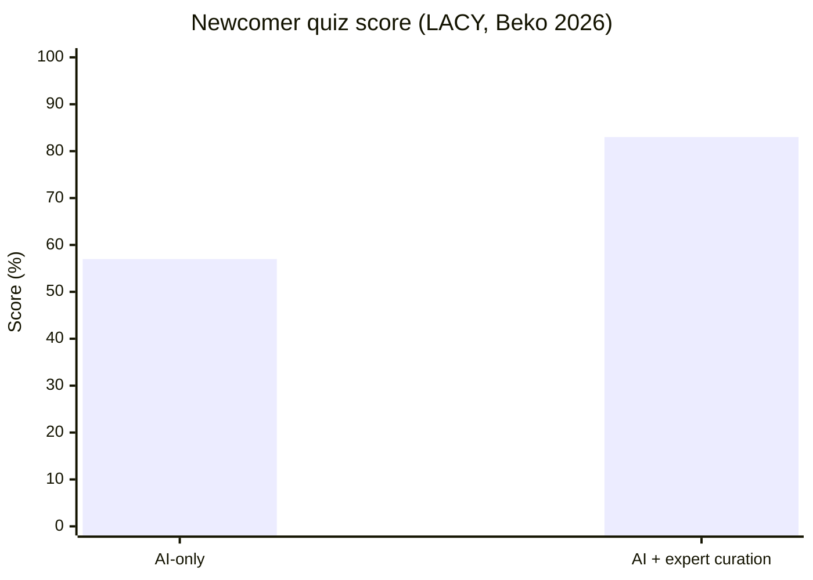
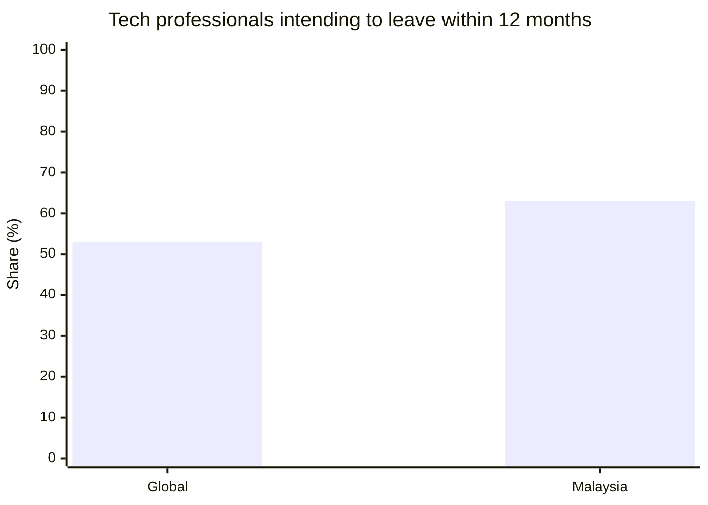
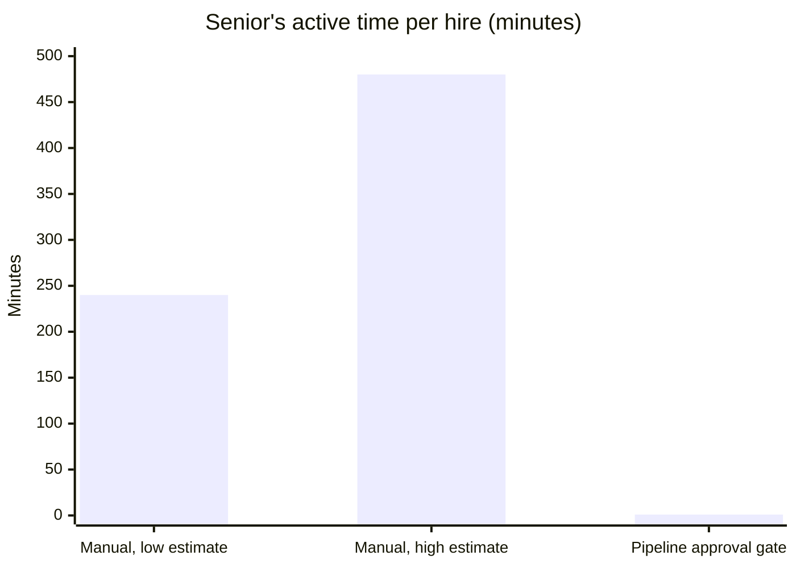
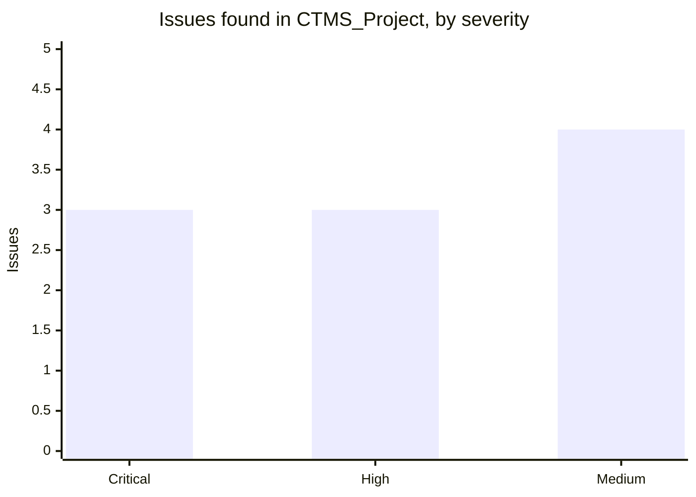
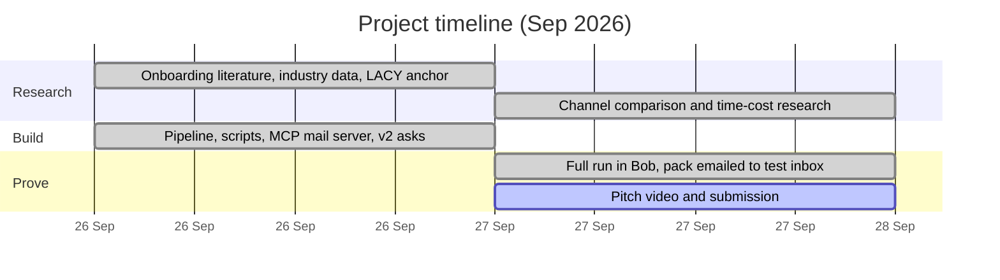

# Bob Onboarding Pipeline — from a raw codebase to a verified onboarding pack, with IBM Bob 2.0

**Workflow improved: developer onboarding.** Bob Onboarding Pipeline turns a real codebase into a personalized onboarding pack for a specific new hire — a branded PDF, a narrated code tour, one file per real issue found, a context folder for their own Bob, and a manager brief. Parallel Bob subagents do the generation; deterministic tooling checks every claim before anything renders or sends.

## The problem

A new developer's first weeks are slow and inconsistent. They get a stale README and a wiki link, while a senior spends days re-explaining where the code starts, what's broken, and which tools to install. The knowledge lives in people's heads, so:

- Every hire gets a different, ad-hoc onboarding experience
- The team pays for it twice — the newcomer's ramp-up time and the senior's lost time
- Nothing is grounded in the actual code, so guidance drifts stale within weeks

This costs real hours per hire, and there's no repeatable, testable process behind it — just whoever happens to onboard you.

## Research basis

Every design choice maps to a published finding. Full notes, sources and evidence grades: [`bob-onboarding-poc/Research/`](bob-onboarding-poc/Research/) (start with [`synthesis/04-patterns.md`](bob-onboarding-poc/Research/synthesis/04-patterns.md)).

**1. Comprehension, not coding, is the bottleneck.** Developers spend **~58%** of their time understanding code (Xia et al., IEEE TSE 2018, 79 devs / 3,244 h). New hires take **91 days** to reach their 10th PR without help, **49** with daily AI use (DX 2025).



**2. AI alone underperforms; AI + expert curation wins.** In LACY (Beko, arXiv 2603.25391), newcomers scored **83%** with expert-curated material vs **57%** with AI-only output. This is why the pipeline has a hard human approval gate.



**3. The problem is bigger in Malaysia.** **63%** of Malaysian tech professionals intend to change employer within 12 months vs **53%** globally (Hays, Aug 2025), and Malaysia has the highest tech turnover in SEA at **17.4%** (Aon 2026). More churn means more onboarding, more often.



**4. Channel choice.** No study compares email vs email+PDF vs email+PDF+video+context folder head to head. Adjacent evidence predicts **email < email+PDF < email+PDF+video+context**, with most of the gain from the PDF and the queryable context folder, and the least-proven gain from video (moderate confidence; [`Research/channel-comparison/04-synthesis.md`](bob-onboarding-poc/Research/channel-comparison/04-synthesis.md)).

> **Honest limit:** there is no study of developer onboarding in Malaysia specifically. The local case chains separately measured numbers (turnover, intent to leave, skill gaps) onto an internationally measured mechanism (comprehension cost).

## The solution

**`hires/alex-tan.yaml`** → **`/onboard`** (Bob skill: `onboarding-pipeline`)

**Stage 0 — Intake**
Confirm codebase, company, and hire details.

**Stage 1 — Generate** (4 parallel subagents, each grounded in the real repo)
- Company & role subagent
- Architecture & code tour subagent
- Issue scan subagent
- Tech stack subagent

> Each subagent reads the real repo and writes its section with file:line evidence — not opinions.

**Stage 2 — Merge**
Combines subagent output into `pack.md`, `manager.md`, `storyboard.json`.

**Stage 3 — Check**
Verifies every citation exists on disk.

**Stage 4 — Human approval gate** (hard stop)
Nothing proceeds without explicit sign-off.

**Stage 5 — Render**
Produces the PDF and narrated video.

**Stage 6 — Package**
Builds `context.zip` for the newcomer's own Bob.

**Stage 7 — Send**
Delivers via the onboarding-mail MCP server (Bob-built).

**Output:** `onboarding/<hire>.pdf` · `<hire>-tour.mp4` · `context/` · `flagged.md`
## Bob features used

| Bob feature | How this project uses it |
|---|---|
| Skill + slash command | Packaged as `.bob/skills/onboarding-pipeline` with an `/onboard` command; Bob follows the stage list exactly |
| Agent mode | The full pipeline runs end to end as one Bob-driven workflow, stage by stage |
| Parallel subagents | Four subagents generate company/role, architecture/tour, issue scan, and tech stack at once, each in isolated context |
| Document understanding | Reads the target repo's source, manifests, and docs to ground every claim in real code |
| MCP server creation | Bob built `mcp/onboarding-mail/server.py` itself — a local STDIO server exposing `send_onboarding_email`, SMTP from env vars only, with a `--dry-run` mode |
| Bounded fix loop | When a deterministic check fails, Bob repairs mechanically first, then makes the smallest targeted fix — max 3 attempts per stage |
| Human-in-the-loop gate | Bob stops at Stage 4 and shows the flagged list; nothing renders or sends without explicit approval |

## Why you can trust it

Onboarding material that invents facts is worse than none — so the pipeline never lets the model grade itself:

- Every cited `file:line` is checked with plain Python against the real repository — not self-reported by the agent
- Anything Bob can't confirm becomes `"Unknown, ask your buddy"` on a flagged list, never a guess
- A human must approve the flagged list before anything renders or sends — tool auto-approve does not count as approval
- The target codebase is opened **read-only**; secrets are never copied into the onboarding pack
- The checker itself is tested: `_guide_self_test` and `_storyboard_self_test` cover the cases that matter — redundant on-screen/narration text, missing flow coverage, and citation drift

## Commands

| Command | What it does |
|---|---|
| `/onboard @<codebase> @hires/<name>.yaml` | Full pipeline: intake → 4 parallel subagents → merge → check → human gate → render → send |
| `python scripts/pipeline_tools.py check` | Re-run the deterministic citation/consistency checks without regenerating content |
| `python scripts/pipeline_tools.py check-mcp --fix` | Detect SMTP credentials in `.env` and register the mail server accordingly (dry-run or live) |
| `python scripts/selftest.py` | Verify the whole toolchain (PDF render, video render, checks) before a real run |

## Demo target

`CTMS_Project` — a Java/JSP Jakarta EE cinema ticket booking system (movies, showtimes, seat bookings, Stripe payments), chosen because it's a real, undocumented legacy-style codebase with genuine problems for a new hire to discover:

| Severity | Issues found |
|---|---|
| 🔴 Critical | Hardcoded DB credentials, hardcoded Stripe key + webhook secret, plaintext password comparison |
| 🟠 High | SQL syntax bug in `CustomerDAO.deleteCustomer`, no test suite, no connection pooling |
| 🟡 Medium | Duplicate servlet declarations, null-session handling gap, password exposed in session, no input validation |

All 10 issues are reported with `file:line` evidence and guidance — not a patch — so the hire understands *why*, not just *what*.

## Impact

| | Manual | Bob Onboarding Pipeline |
|---|---|---|
| Senior's time to prepare material for one hire | an estimated **4–8 hours** (written pack only) | **~20 minutes** machine time + ~1 minute human approval |
| Consistency across hires | depends who's free that week | same deterministic process every time |
| Grounded in real code | only if the senior double-checks | every claim verified against `file:line` |
| Issues surfaced before day one | usually none | 10 found automatically, including 3 credential leaks |





**How the 4–8 hour estimate was built:** no published benchmark exists for "hours to hand-write one onboarding pack" (searched directly). The range comes from a ~2 h proxy per onboarding-doc section × 4–5 sections, plus 10 issues each needing investigation and write-up. At Malaysian senior rates (RM55–85/h) that is **RM220–680** of senior time per hire, vs **~RM1–1.50** for the 1-minute approval. For wider context, experts at Beko reported **20–40 hours** per new hire on onboarding overall (LACY), but that covers all walkthroughs and re-explaining, not just writing a pack. Full reasoning: [`Research/synthesis/06-time-cost-comparison.md`](bob-onboarding-poc/Research/synthesis/06-time-cost-comparison.md).

*Proof of concept — tested on one project so far. The manual figure is an estimate, not a timed measurement.*

## Advantages, disadvantages and impact

### Advantages
- **Personalised per hire, not one generic tour.** Role, experience level, start date, buddy and starter tasks are specific to the named person. Comparable tools such as LACY generate one tour per repo and reuse it for everyone.
- **Grounded, not self-graded.** Plain Python, not the model, confirms that every cited `file:line` exists before anything ships. Anything unconfirmed becomes "Unknown, ask your buddy".
- **A human always signs off, cheaply.** Review is narrowed to a short flagged list (3–6 bullets), not the whole pack. This follows the research: curated material scored 83% vs 57% for AI-only (LACY).
- **Fresh per hire, not stale once.** The pack is regenerated from the live repo for every hire, so it doesn't rot like a wiki page.
- **Portable, works before day one.** A PDF and email need no tool install. The context folder upgrades the newcomer's own Bob into an assistant that already knows the codebase.
- **Questions go somewhere real.** The email's reply-to is the newcomer's buddy, so there's no new Q&A system to maintain.
- **Generic core.** A new company is a folder in `instances/`, not a code change.

### Disadvantages and limits
- **Tested on one project so far.** Not yet validated on a second, larger codebase or with a real cohort of new hires.
- **The time saving is an estimate.** The 4–8 h manual baseline is built from proxies, not a timed measurement.
- **The Malaysia case is inferred.** It chains international and regional numbers; there is no local study of developer onboarding.
- **Supporting studies are small.** LACY (a small deployment at Beko; 2 experts surveyed) and TARS (n=18) are early evidence; the headline claim leans on Xia et al. (79 devs, 3,244 h).
- **No live Q&A.** Follow-up questions go to the buddy by email, not to an interactive assistant (a deliberate scope cut).
- **Tied to IBM Bob IDE, run interactively.** Headless/CI execution (`bob run`) is unconfirmed, so a person has to start each run.
- **Video is the least-proven channel.** It needs extra tools (Piper TTS + ffmpeg, ~63 MB), and the evidence for its value is weaker than for the PDF and context folder.

### Impact
| Who | Impact | Basis |
|---|---|---|
| Senior / manager | Active time per hire drops from an estimated **4–8 h** to **~1 min** of approval (≈ RM220–680 → ~RM1–1.50) | Estimate, [`06-time-cost-comparison.md`](bob-onboarding-poc/Research/synthesis/06-time-cost-comparison.md) |
| New hire | Gets a code tour, first tasks and a dated timeline before day one, aimed at the comprehension work that takes ~58% of dev time | Xia et al. 2018; demo output |
| Codebase / security | Real problems surface before day one: **10 issues** in the demo, including **3 hardcoded credential leaks** | Demo run on CTMS_Project |
| Team | Every hire gets the same checked process instead of whoever is free that week | Pipeline design |
| Malaysian employers | With 63% of tech staff planning to move within 12 months and 17.4% turnover, onboarding repeats more often, so the per-hire saving compounds | Hays 2025, Aon 2026 (inferred, not measured) |

## Where we are today

**Status (27 Sep 2026):** v2 built and run end to end in Bob. PDF, tour video and context zip were delivered by the Bob-built MCP server to an Ethereal test inbox.

| Stage | What happened in the demo run | Result |
|---|---|---|
| Preflight | `check-mcp --fix` built and registered the MCP mail server | ✅ |
| 0 Intake | `intake.yaml` for Alex Tan / CTMS_Project / Northwind Labs | ✅ |
| 1 Generate | 4 parallel subagents → company, role, architecture, tech stack, 10 issues | ✅ |
| 2 Merge | `pack.md`, `manager.md`, 9-scene `storyboard.json`, `timeline.md` | ✅ |
| 3 Check | Deterministic check passed after the bounded fix loop repaired citations and narration | ✅ |
| 4 Flag | `flagged.md`: 5 items Bob could not confirm | ✅ |
| 5 Approval | Human approved the flagged list | ✅ |
| 6 Render | 7-page PDF, 97 s tour video (4 MB), context zip | ✅ |
| 7 Send | Newcomer + manager emails via `send_onboarding_email` | ✅ |

Toolchain checks: `pipeline_tools.py check` OK · `selftest.py` ALL OK · MCP server tests 14/14 pass.



**Next steps**
- Run the pipeline on a second, larger codebase (so far it has been tested on one project).
- Replace the 4–8 h estimate with a timed manual baseline (a senior writes the same pack by hand).
- Test channel value with real newcomers, cheapest signal first: context folder vs none, then PDF vs email, then video vs none.

## Run it

Requirements: IBM Bob IDE with `bob-onboarding-poc/Development/` open as the workspace, Python 3 with `pycairo`, and a `.env` with `SMTP_HOST`, `SMTP_PORT`, `SMTP_USER`, `SMTP_PASS` (without it the mail server runs in `--dry-run`).

```bash
cd bob-onboarding-poc/Development
python scripts/selftest.py            # confirm the toolchain is clean (prints ALL OK)
python scripts/make_video.py --doctor # optional: check the narrated-video tools
```

In Bob:

```
/onboard @instances/northwind-labs/instance.yaml @instances/northwind-labs/hires/alex-tan.yaml
```

Then open `onboarding/alex-tan/` and check your configured test inbox for the delivered pack. The output from our demo run is committed there for reference.

## Repository map

| Path | What it is |
|---|---|
| [`bob-onboarding-poc/Development/`](bob-onboarding-poc/Development/) | The pipeline: Bob skill + `/onboard` command, scripts, MCP mail server, requirements |
| [`bob-onboarding-poc/Development/onboarding/alex-tan/`](bob-onboarding-poc/Development/onboarding/alex-tan/) | Demo run output: PDF, tour video, context zip, 10 issue files, flagged list |
| [`bob-onboarding-poc/Development/instances/northwind-labs/`](bob-onboarding-poc/Development/instances/northwind-labs/) | Client-specific data (company handbook, role, hire file) |
| [`bob-onboarding-poc/Research/`](bob-onboarding-poc/Research/) | Research behind every design decision |
| [`bob-onboarding-poc/pitch/`](bob-onboarding-poc/pitch/) | Video scripts, submission text, 22 screenshots of the Bob run |
| [`CTMS_Project/`](CTMS_Project/) | Demo target codebase |

## Bring this to your own project

The core is generic — everything client-specific lives in one hire file and one target-codebase path:

1. Point `/onboard` at your own repo instead of `CTMS_Project`
2. Write a new `hires/<name>.yaml` with role, dates, manager, and buddy
3. Run `/onboard @<your-repo> @hires/<name>.yaml`

A new hire — or a new company entirely — is a new file, not a code change.
